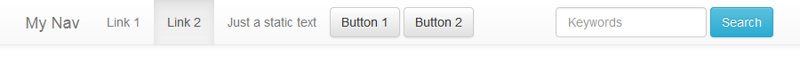

# PROJECT UNMAINTAINED

> *This project is not maintained anymore*
>
> *If you like it or continue to use it fork it please.*

* * *
* * *

A CakePHP Bootstrap Navbar
--------------------------
An easy to use navbar using Twitter Bootstrap 3 (<http://getbootstrap.com>).

* * *

##### INSTALLATION

- Add Bootstrap files to CakePHP 
- Copy navbar.ctp in app/View/Elements
- In your views use the element 'navbar'

##### USAGE EXAMPLE

	$items = array();
	$items[] = array( 'list', array( 'Link 1' => '/tests/link1', 'Link 2' => '/tests/link2' ) );
	$items[] = array( 'text', 'Just a static text' );
	$items[] = array( 'button', 'Button 1', '/tests/link3' );
	$items[] = array( 'button', 'Button 2', '/tests/link4' );
	$items[] = array( 'form', array( 'btn' => 'Search', 'btn_class' => 'btn-info', 'holder' => 'Keywords' ), 'navbar-right' );
	echo $this->element( 'navbar', array( 'id' => 'MyNav', 'title' => 'My Nav', 'inverse' => FALSE, 'fixed' => 'top', 'fluid' => FALSE, 'items' => $items, 'active' => 'Link 2' ) );

* * *

My website: <https://blocknot.es/>
